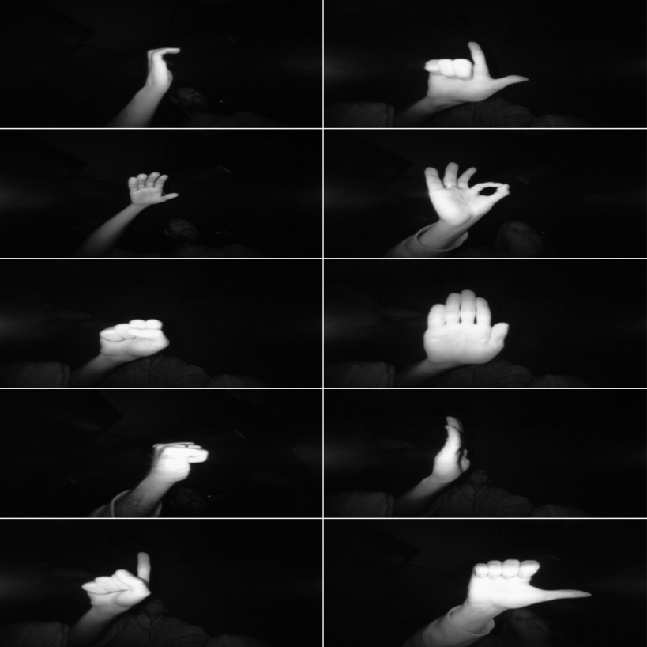

<h2 align = center>  </h2>
<h1 align="center">
   📍 &nbsp Guia DailyHack 2023 &nbsp 📍
</h1>

# Què és un _DailyHack_ ? ℹ️
Molt bones, Hackers! Des de LleidaHack venim a presentar-vos el nou DailyHack d'aquest any!

En les darreres edicions de la HackEPS sempre us hem preparat una serie de mini-reptes abans que tingui lloc la hackaton. Ho fem amb la intenció de fer-vos calentar una mica els motors, i aquest any hem decidit canviar-ne el format. Us escoltem, i sabem que un únic repte més elaborat i amb diversos premis us atreu més que multiples reptes simples amb un únic premi, així que aquest serà el format per aquesta edició.

# De que va el repte? 🤔

El repte gira al voltant de la creació d'un sistema que pugui generar text a partir de gestos de mà capturats en imatges. A partir d'un repte ja existent de [Kaggle](https://www.kaggle.com), proporcionem un emocionant [conjunt de dades](https://www.kaggle.com/datasets/gti-upm/leapgestrecog) de posicions de mà amb 10 categories diferents, incloent-hi "palma", "polze" i altres. La tasca central no consisteix a desenvolupar un model, sinó a fer-ne ús d'una manera innovadora i creativa.

# Imatges del dataset 🖼

A continuació es mostren les 10 possibles categories que detectarà el model junt amb una imatge d'exemple de cadascuna d'aquestes.

<h2 align = center>  

|                |                 |
|----------------|-----------------|
| forma de 'C'   |  forma d' 'L'   |
| des de sota    |   'OK'          |
| puny           | palma           |
| puny de perfil | palma de perfil |
| index          | polze           |

</h2>

# Obtenir un model 📦

Ja que el que es valorarà del repte és l'ús que es faci del model i no la seva implementació com a tal (tot i que us animem a intentar implementar-lo ja que pot ser una experiència molt enriquidora), volem aclarir com obtenir un model ja implementat per aquells que no estiguin familiaritzats amb la web Kaggle.

És ben senzill, si anem a l'[enllaç](https://www.kaggle.com/datasets/gti-upm/leapgestrecog) al repte veurem que hi ha un apartat anomenat 'Code', si hi navegem podrem trobar un llistat de totes les solucions penjades, on els usuaris acostumen a explicar com ho han fet. Qualsevol de les implementacions que trobeu us resultaran utils per resoldre el DailyHack.

# Que ha de fer el meu programa? 👨‍💻
El vostre objectiu és utilitzar el model de classificació de posicions de mà per crear un llenguatge gestual únic i innovador. A continuació, detallem com podeu abordar aquest desafiament amb creativitat:

\
__Punt de partida: El model de classificació de posicions de mà__

Començareu amb un model que és capaç de classificar diferents posicions de mà, com "palma", "polze", "index" i més. Aquest model ja estarà entrenat i llest per a la classificació.

\
__Pas 1: Associació de posicions de mà amb paraules/lletres__

El següent seria associar les diferents posicions de mà amb paraules o lletres per crear un llenguatge gestual. Per exemple, podeu decidir que "polze" representa la lletra "H", "palma" representa la lletra "O" i així successivament. També podeu optar per paraules completes: "polze" = "Hola" i "index" = "món". O bé per a tenir un vocabulari més ampli, podeu associar mes d'una foto per a cada parula, és a dir, fer que introdüint una foto de "polze" i després una d'"index" generi la paraula "Adeu". Les possiblitats són infinites i deixem en les vostres mans establir l'associació entre posicions i paraules.

\
__Pas 2: Creant text a partir de gestos__

Un cop hagueu fet aquesta associació entre posicions de mà i paraules/lletres, el vostre programa o aplicació hauria de ser capaç de prendre una seqüència d'imatges de posicions de mà com a entrada i generar un text com a sortida. Si la seqüència d'imatges és "polze" seguit de "index", el text generat podria ser "Hola món".

\
__Pas 3: Treure suc al llenguatge__

Aquí és on la vostra creativitat pot brillar. Penseu en maneres de fer que el llenguatge gestual sigui més ric i versàtil. Podríeu crear frases fetes, com una seqüència de posicions que representen una pregunta comú ("Com estàs?").

\
__Pas 4: Entrada de dades__

Una part clau d'aquest repte és oferir una forma d'entrada de dades al programa que hagueu creat de manera que permeti als usuaris capturar imatges de les seves pròpies posicions de mà. Aquestes imatges es processarien utilitzant el vostre model i es generaria el text associat. 

> __Nota__: No cal fer interfície gràfica (tot i que és valorarà si és el cas), és suficient amb que proporcioneu una forma d'entrar una seqüencia d'imatges al vostre programa ni que sigui a través d'arguments de terminal.

# Entrega 🚚

Caldrà lliurar un enllaç a un repositori de GitHub (o Gitlab) que cotingui el vostre programa o aplicació acompanyat d'una demostració del seu ús. Podeu incloure un GIF al ´README.md´ que mostri com les posicions de mà es converteixen en text. Proporcioneu també instruccions detallades per reproduir la demostració. 

Recordeu, la que clau aquí és la creativitat. Us encoratgem a explorar maneres úniques de comunicar-vos mitjançant el llenguatge gestual generat pel vostre model. Prepareu-vos per sorprendre'ns amb la vostra capacitat de donar vida a un nou i apassionant mètode de comunicació!

# Informació útil 🐒
Us deixem alguns enllaços que poden resultar d'ajuda:

[Kaggle](https://www.kaggle.com)

[Dataset per al DailyHack](https://www.kaggle.com/datasets/gti-upm/leapgestrecog)

[Solucions al repte del Kaggle](https://www.kaggle.com/datasets/gti-upm/leapgestrecog/code)

[Frases comunes en català](https://www.ielanguages.com/catalan.html)

[Llibreria de python per a crear GUIs](https://docs.python.org/3/library/tkinter.html)

[Llibreria de python per a crear models de ML](https://pytorch.org/)

[How to create an invented language from a gesture classification model](https://youtu.be/V-_O7nl0Ii0?t=17)
